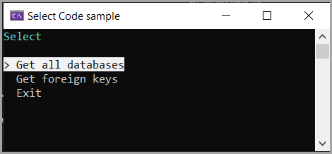
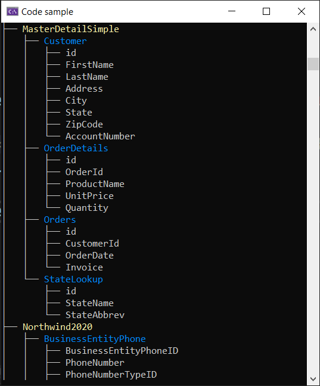

# About

Example to get a database names and their table names and writes them to a simple text file and display in a tree view.

Do not run `Get foreign keys' without changing `ApplicationSettings.Catalog` setting in `appsettings.json`



## Before running

1. If not using SQLEXPRESS, change it 
1. Under `ApplicationSettings` change the server if not using SQLEXPRESS


```json
{
  "ConnectionsConfiguration": {
    "ActiveEnvironment": "Development",
    "Development": "Data Source=.\\SQLEXPRESS;Initial Catalog=master;Integrated Security=True;Encrypt=False"
  },
  "ApplicationSettings": {
    "Server": ".\\SQLEXPRESS",
    "Catalog": "NorthWind2024" 
  } 
}
```



## Details
- Written in NET8
- Uses [Dapper](https://www.nuget.org/packages/Dapper) NuGet package
- [Spectre.Console](https://www.nuget.org/packages/Spectre.Console/0.46.0?_src=template) for menu and tree
