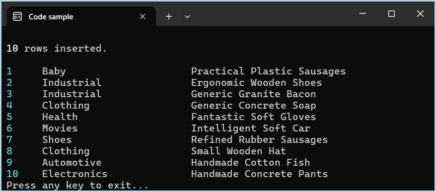

# About

An example of using `Dapper` to perform multiple inserts in a single database transaction. This is useful for scenarios where you need to insert multiple records efficiently without the overhead of multiple round trips to the database.

Recommend not using this approach for large datasets, as it may lead to performance issues. Instead, consider using bulk insert operations or other optimized methods for handling large volumes of data.

## Bogus

Bogus is used to create data and note the description will be off yet that is good enough.