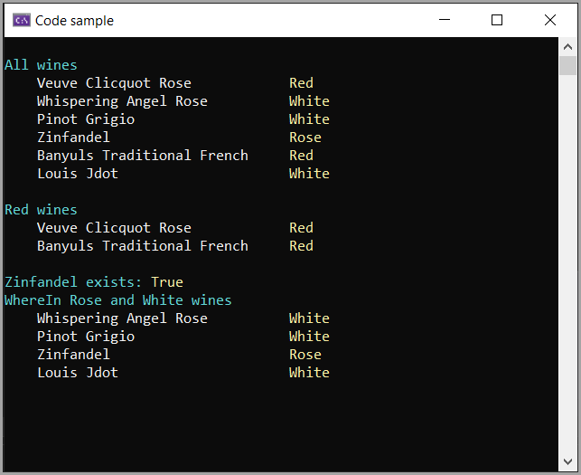

# About

Code sample for [Dapper](https://www.nuget.org/packages/Dapper) using enum natively.

Currently only have read operations, other methods to be added shortly.

## Before running this project

Create database and populate

1. Connection string is in appsettings.json using `(localdb)\\mssqllocaldb` change if desire.
1. Create `WineDapper` database
1. Run `Scripts\script.sql` in this project to create tables and populate data.

