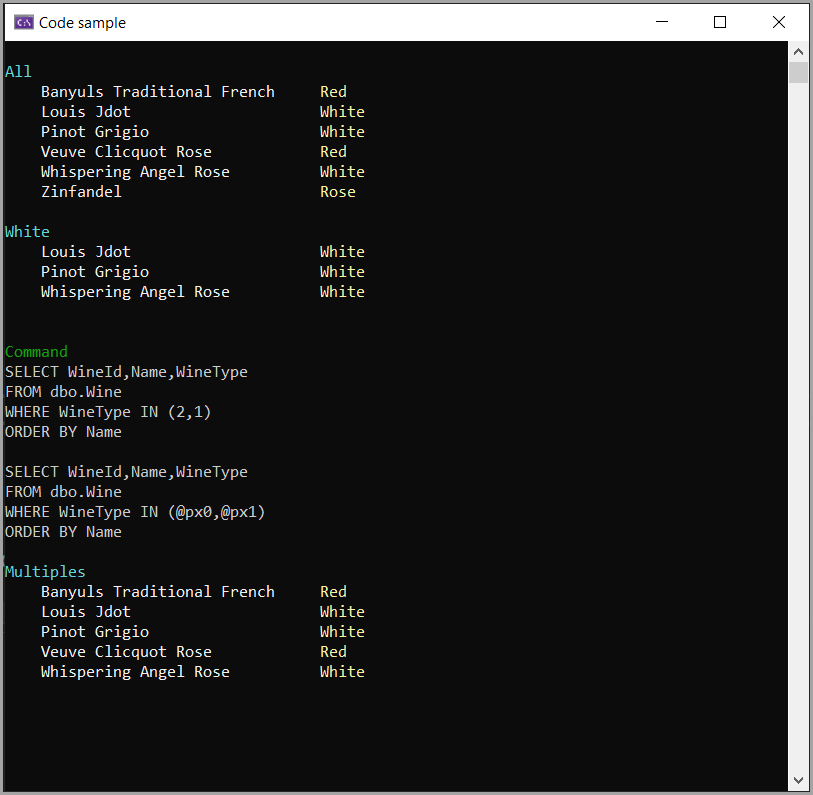

# About

Code sample working with an SQL-Server table with an enum using a connection and command object, no Dapper or EF Core.



## Models

```csharp
public enum WineType
{
    Red = 1,
    White = 2,
    Rose = 3
}

public class Wine
{
    public int WineId { get; set; }
    public string Name { get; set; }
    public WineType WineType { get; set; }
}
```

## Converting WineType

Uses the following extension method

```csharp
public static class ExtensionMethods
{
    public static WineType ToWineType(this SqlDataReader reader, int index)
    {
        return (WineType)reader.GetInt32(index);
    }
 }
```

Example iterating over a DataReader.

```csharp
public static List<Wine> AllWines()
{
    List<Wine> wines = new();
    const string statement =
        """
        SELECT WineId
            ,Name
            ,WineType
        FROM dbo.Wine
        ORDER BY Name
        """;

    using var cn = new SqlConnection(ConnectionString());
    using var cmd = new SqlCommand(statement, cn);

    cn.Open();

    using var reader = cmd.ExecuteReader();

    while (reader.Read())
    {
        Wine wine = new()
        {
            WineId = reader.GetInt32(0),
            Name = reader.GetString(1),
            WineType = reader.ToWineType(2)
        };
        wines.Add(wine);
    }

    return wines;
}
```

Same as above to get all wines of a specific type

```csharp
public static List<Wine> WinesByType(WineType wineType)
{
    List<Wine> wines = new();
    const string statement =
        """
        SELECT WineId
            ,Name
            ,WineType
        FROM dbo.Wine
        WHERE WineType = @WineType
        ORDER BY Name
        """;

    using var cn = new SqlConnection(ConnectionString());

    using var cmd = new SqlCommand(statement, cn);
    cmd.Parameters.AddWithValue("@WineType", wineType.IntValue());

    cn.Open();

    using var reader = cmd.ExecuteReader();

    while (reader.Read())
    {
        Wine wine = new()
        {
            WineId = reader.GetInt32(0),
            Name = reader.GetString(1),
            WineType = reader.ToWineType(2)
        };
        wines.Add(wine);
    }

    return wines;
}
```

## WHERE IN

For this a special extension method is used to parameterize an int array created by an array of WineTypes (Enum) found under Classes\ExtensionMethods\WhereInConfiguration

```csharp
public static List<Wine> WhereIn(WineType[] wineTypes)
{
    List<Wine> wines = new();
    const string statement =
        """
        SELECT WineId,Name,WineType
        FROM dbo.Wine
        WHERE WineType IN ({0})
        ORDER BY Name
        """;

    using var cn = new SqlConnection(ConnectionString());
    using var cmd = new SqlCommand(statement, cn);

    var values = wineTypes.Select(x => x.IntValue()).ToArray();
    cmd.WhereInConfiguration(statement, "px", values);

    cn.Open();

    using var reader = cmd.ExecuteReader();

    while (reader.Read())
    {
        Wine wine = new()
        {
            WineId = reader.GetInt32(0),
            Name = reader.GetString(1),
            WineType = reader.ToWineType(2)
        };
        wines.Add(wine);
    }

    return wines;

}
```