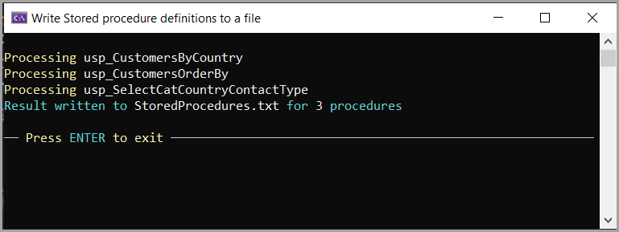

# About

Writes definitions of stored procedures for a database to a text file using code from the project `SqlServerLibrary`, class `StoredProcedureHelpers` using `Dapper`.

## Usage

Set the database connection string in `appsettings.json`

