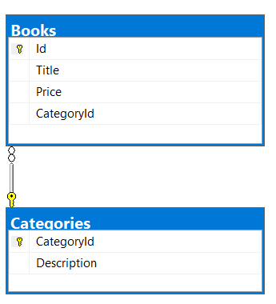

# About

In this article learn how to use [Dapper](https://github.com/DapperLib/Dapper) an open-source object-relational mapping (ORM) library for .NET and .NET Core applications. Unlike many articles out there, this one will provide source code to try everything out that is shown in an easy-to-follow way by beginning with a single table then in part two of this series will work with multiple tables.

## Is Dapper worth it?
Dapper is a good choice for applications that require high performance and efficiency. Dapper is also a good choice for applications that need to work with older versions of SQL Server or other databases. Dapper is also a good choice for applications that require more control over the SQL that is generated.

## Is Dapper better than EF Core?
Performance: Dapper is typically more performant than EF Core due to its lightweight nature and lack of overhead. Control over SQL Queries: With Dapper, you have full control over your SQL queries, which can lead to more optimized database operations.

> **Note**
> Above two statements were stolen from the web. Could not write it any better.

## Prerequisites

- Have a basic understanding of C# and SQL
- Have Microsoft Visual Studio 2022 or higher
- Familar with and have SSMS (SQL-Server Management Studio) installed.

# Table for this article


# Tables for part two of this series



## SQL Statements

None of the code samples have inline SQL statements, instead all statements are stored in a class.

Each statement were first created in SSMS and tested rather than writing statements in code and assume they will work which many developer do. Also, zero string concatenation, all statements are done in read-only [raw string literals](https://learn.microsoft.com/en-us/dotnet/csharp/language-reference/tokens/raw-string).

```csharp
public class SqlStatements
{
    public static string InsertPeople =>
        """
        INSERT INTO dbo.Person
        (
            FirstName,
            LastName,
            BirthDate
        )
        VALUES
        (@FirstName, @LastName, @BirthDate);
        SELECT CAST(scope_identity() AS int);
        """;
 . . .
}
```

## Project type

To reach the widest audience possible, a Windows Forms project is used rather than web as the architecture is different and with console projects the code can get too much for a novice developer as I would need to create a menu system hard for some to understand.

## Dapper DateOnly and TimeOnly support

Dapper does not support the new DateOnly and TimeOnly types in .NET 6.0. To get around this, a custom type handler is created. 

To support DateOnly and TimeOnly the following SqlMapper.TypeHandle are provided.

```csharp
public class DapperSqlDateOnlyTypeHandler : SqlMapper.TypeHandler<DateOnly>
{
    public override void SetValue(IDbDataParameter parameter, DateOnly date)
        => parameter.Value = date.ToDateTime(new TimeOnly(0, 0));

    public override DateOnly Parse(object value)
        => DateOnly.FromDateTime((DateTime)value);
}
public class SqlTimeOnlyTypeHandler : SqlMapper.TypeHandler<TimeOnly>
{
    public override void SetValue(IDbDataParameter parameter, TimeOnly time)
    {
        parameter.Value = time.ToString();
    }

    public override TimeOnly Parse(object value) => TimeOnly.FromTimeSpan((TimeSpan)value);
}
```

Usage for these is shown in the code samples below.

## Basics

Let me convince you that Dapper is much better than using a connection and command objects.

### Adding a collection of records

A common operation is to add several records to a database table. And let's keep out bulk method options as this is not what is being taught.

Using conventional method

- Requirements
    - Test the database connection
    - Create a connection object
    - Create a Transation object
    - Create a command object and parameters
    - Wrap code in a try/catch
    - Open the connection
    - Iterate throught a collection
    - Execute the command
    - Assign the primary key to each item in the collection.

```csharp
public static void InsertPeople(List<Person> people)
{
	using var connection = new SqlConnection(ConnectionString);
	using var transaction = connection.BeginTransaction();
	using var command = connection.CreateCommand();
	command.Transaction = transaction;
	command.CommandText = SqlStatements.InsertPeople;
	command.Parameters.Add("@FirstName", SqlDbType.NVarChar);
	command.Parameters.Add("@LastName", SqlDbType.NVarChar);
	command.Parameters.Add("@BirthDate", SqlDbType.Date);
	try
	{
		connection.Open();
		foreach (var person in people)
		{
			command.Parameters["@FirstName"].Value = person.FirstName;
			command.Parameters["@LastName"].Value = person.LastName;
			command.Parameters["@BirthDate"].Value = person.BirthDate;
			person.Id = (int)command.ExecuteScalar();
		}
		transaction.Commit();
	}
	catch (Exception ex)
	{
		transaction.Rollback();
		throw new Exception(ex.Message);
	}
}
```

Now using Dapper

Notice, less code which means less time to write and less prone to errors.

- No command object
- No command parameters which many developers get wrong in the prior code sample so this means less prone to errors.


> **Note**
> The connection must be opened manually while in other examples below Dapper handles opening a connection and closing the connection for us.

```csharp
public static async Task<(bool, Exception ex)> AddRangeDapperWithKeys(List<Person> list)
{

    var (_, sqlException) = await CanConnect();
    if (sqlException is not null)
    {
        return (false, sqlException);
    }

    SqlMapper.AddTypeHandler(new DapperSqlDateOnlyTypeHandler());

    try
    {
        await using SqlConnection cn = new(ConnectionString());
        await cn.OpenAsync();

        await using (var transaction = cn.BeginTransaction())
        {
            foreach (var person in list)
            {
                
                var primaryKey = await transaction.ExecuteScalarAsync(
                    SqlStatements.InsertPeople, 
                    person);

                person.Id = (int)primaryKey!;
            }

            await transaction.CommitAsync();

        }

        return (list.All(p => p.Id > 0), null);
    }
    catch (Exception ex)
    {
        return (false, ex);
    }
}
```

### Adding a single record

Using conventional method to add a single record. Pretty much the same as when adding multiple records. Only difference is no transaction.


```csharp
public static async Task Add(Person person)
{
    await using SqlConnection cn = new(ConnectionString());
    await using SqlCommand cmd = new()
    {
        Connection = cn,
        CommandText = SqlStatements.InsertPeople
    };

    cmd.Parameters.Add("@Id", SqlDbType.Int).Value = person.Id;
    cmd.Parameters.Add("@FirstName", SqlDbType.NVarChar).Value = person.FirstName;
    cmd.Parameters.Add("@LastName", SqlDbType.NVarChar).Value = person.LastName;
    cmd.Parameters.Add("@BirthDate", SqlDbType.Date).Value = person.BirthDate;

    await cn.OpenAsync();

    person.Id = Convert.ToInt32(await cmd.ExecuteScalarAsync());
    
}
```

Using Dapper

In this example the connection is opened for us by Dapper.

```csharp
public static async Task AddDapper(Person person)
{
    SqlMapper.AddTypeHandler(new DapperSqlDateOnlyTypeHandler());
    await using SqlConnection cn = new(ConnectionString());

    var primaryKey = await cn.ExecuteScalarAsync(
        SqlStatements.InsertPeople, 
        person);

    person.Id = (int)primaryKey!;
}
```

### Get a single record

Using conventional method

```csharp
public static async Task<Person> Get(int id)
{
    await using SqlConnection cn = new(ConnectionString());
    await using SqlCommand cmd = new()
    {
        Connection = cn,
        CommandText = SqlStatements.Get
    };

    cmd.Parameters.Add("@Id", SqlDbType.Int).Value = id;

    await cn.OpenAsync();
    var reader = await cmd.ExecuteReaderAsync();
    await reader.ReadAsync();

    Person person = new Person
    {
        Id = id,
        FirstName = reader.GetString(1),
        LastName = reader.GetString(2),
        BirthDate = reader.GetDateOnly(3)
    };

    return person;
}
```

Using Dapper

```csharp
public static async Task<Person> GetDapper(int id)
{
    SqlMapper.AddTypeHandler(new DapperSqlDateOnlyTypeHandler());

    await using SqlConnection cn = new(ConnectionString());
   
    return await cn.QuerySingleAsync<Person>(
        SqlStatements.Get, new 
            {Id = id});

}
```

**Important note**

Note in the above method, QuerySingleAsync second parameter is an anonymous type and must match the parameter in the SQL in this case for SqlStatements.Get. 

From Dapper source code

```csharp
public static Task<T> QuerySingleAsync<T>(this IDbConnection cnn, string sql, object? param = null, IDbTransaction? transaction = null, int? commandTimeout = null, CommandType? commandType = null) =>
    QueryRowAsync<T>(cnn, Row.Single, typeof(T), new CommandDefinition(sql, param, transaction, commandTimeout, commandType, CommandFlags.None, default));

```

### Get all record

Let's jump to Dapper only, as with the last example, no need to open the connection, Dapper handles opening and closing the connection for us.

```csharp
public static List<Person> GetAll()
{
    SqlMapper.AddTypeHandler(new DapperSqlDateOnlyTypeHandler());

    using SqlConnection cn = new(ConnectionString());

    return cn.Query<Person>(SqlStatements.ReadPeople).ToList();

}
```

### Update a record

Conventional method

```csharp
public static async Task<(bool, Exception ex)> Update(Person person)
{
    try
    {

        await using SqlConnection cn = new(ConnectionString());
        await using SqlCommand cmd = new()
        {
            Connection = cn, 
            CommandText = SqlStatements.UpdatePerson
        };

        cmd.Parameters.Add("@Id", SqlDbType.Int).Value = person.Id;
        cmd.Parameters.Add("@FirstName", SqlDbType.NVarChar).Value = person.FirstName;
        cmd.Parameters.Add("@LastName", SqlDbType.NVarChar).Value = person.LastName;
        cmd.Parameters.Add("@BirthDate", SqlDbType.Date).Value = person.BirthDate;

        await cn.OpenAsync();
        var affected = await cmd.ExecuteNonQueryAsync();

        return (affected == 1, null);

    }
    catch (Exception localException)
    {
        return (false, localException);
    }
}
```

Using Dapper

```csharp
public static async Task<(bool, Exception ex)> UpdateDapper(Person person)
{
    try
    {

        await using SqlConnection cn = new(ConnectionString());

        var affected = await cn.ExecuteAsync(
            SqlStatements.UpdatePerson, new
        {
            person.FirstName,
            person.LastName,
            person.BirthDate,
            person.Id
        });

        return (affected == 1, null);

    }
    catch (Exception ex)
    {
        return (false, ex);
    }
}
```

**Note**, the second parameter for ExecuteAsync is an anonymous type and must match the parameters in the SQL statement.

### Delete a record

Conventional method

```csharp
public static async Task<bool> Remove(Person person)
{
    await using SqlConnection cn = new(ConnectionString());
    await using SqlCommand cmd = new() { Connection = cn, CommandText = SqlStatements.RemovePerson };

    cmd.Parameters.Add("@Id", SqlDbType.Int).Value = person.Id;

    await cn.OpenAsync();

    var affected = await cmd.ExecuteNonQueryAsync();

    return affected == 1;

}
```

Using Dapper

```csharp
public static async Task<bool> RemoveDapper(Person person)
{
    await using SqlConnection cn = new(ConnectionString());

    var affected = await cn.ExecuteAsync(
        SqlStatements.RemovePerson, 
        new { person.Id }
        );

    return affected == 1;

}
```

## Run through the project code

If Windows Forms is not your thing, then skip the following paragraph.

The average developer tends not to learn about [BindingList](https://learn.microsoft.com/en-us/dotnet/api/system.componentmodel.bindinglist-1?view=net-7.0) and [BindingSource](https://learn.microsoft.com/en-us/dotnet/api/system.windows.forms.bindingsource?view=windowsdesktop-7.0) when working with data in a windows form project, code done in this project never touches the DataGridView other than set the DataSource property.

### Create the database

Before running the code, open databaseCreateScript.sql under the folder Scripts, adjust the path for where the database resides and then run the script best done in SSMS. paragraph

### Run the project

Build/run the project which presents data created with Bogus, each person has a unique first name and last name, the birth date is random without a primary key.

**Save button**

Clicking the **save button** will dump any existing rows and reset the table identity. Next take the data from the DataGridView and save it to the database using Dapper.

```csharp
var (success, exception) = 
    await DataOperations.AddRangeDapperWithKeys(
        _personList.ToList());
```

The method AddRangeDapperWithKeys once complete will have the primary key for each person in the collection. Next the data is read back from the database and displayed in the DataGridView.

The following method is used to read data and must setup to read DateOnly via DapperSqlDateOnlyTypeHandler() handler.

```csharp
public static List<Person> GetAll()
{
    SqlMapper.AddTypeHandler(new DapperSqlDateOnlyTypeHandler());

    using SqlConnection cn = new(ConnectionString());

    return cn.Query<Person>(SqlStatements.ReadPeople).ToList();

}
```

Note that there is no need to open the SqlConnection connection, Dapper does this for us.

**Current button**


