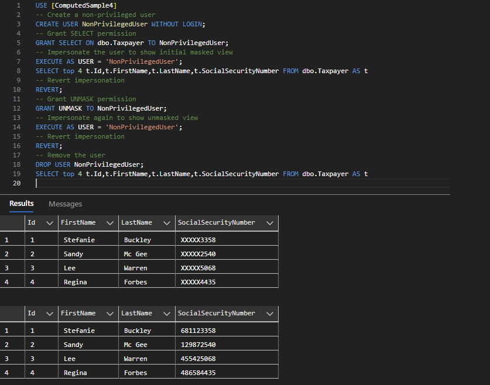

# About

An example for SQL-Server [Dynamic data masking](https://learn.microsoft.com/en-us/sql/relational-databases/security/dynamic-data-masking?view=sql-server-ver16).

The code does not demo data masking, to try out data masking

- First open CreateAndPopulate.sql
    - Alter the database path
    - Execute the script
- Open Impersonations.sql
    - Run the statements

Result should look like

