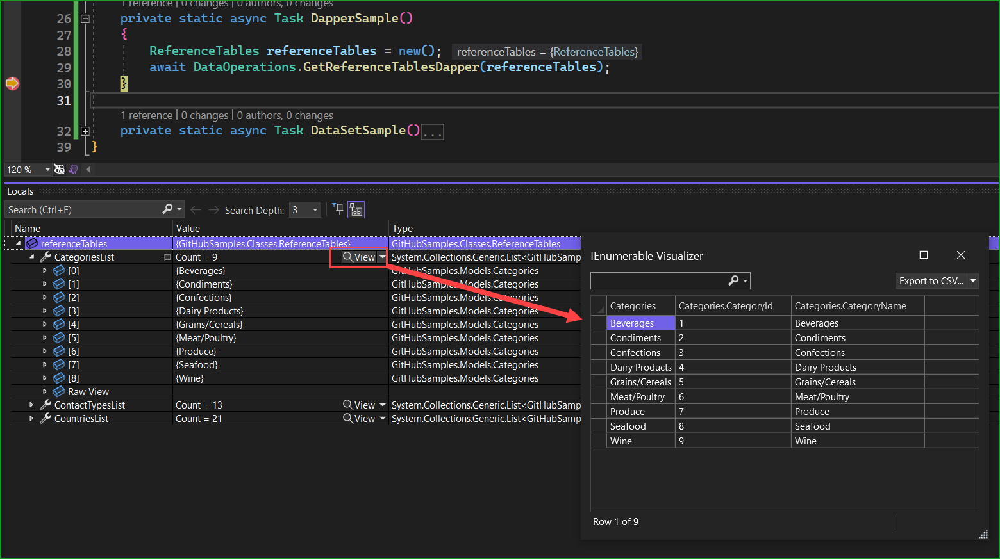

# Multiple Result Sets for SQL-Server


Learn how to read reference table from SQL-Server using a single method. What is shown provides an efficient way to either a connection, command objects to read data via a SqlDataReader for conventional work using methods from SqlClient and also Dapper which requires two lines of code to read data and one line of code to store data into list.

## Goal

To read from three reference table in a modified version of Microsoft NorthWind database, Categories, ContactType and Countries tables.

In all code samples all records are read from each table, in some cases not all records may be needed, simply change the SQL SELECT statement with a WHERE clause. Also, the same goes for columns.

## Project type used

A console project is used although the code provided will work in any project type.

## Creating the database

Open [SSMS](https://learn.microsoft.com/en-us/sql/ssms/download-sql-server-management-studio-ssms?view=sql-server-ver16) (SQL-Server Management Studio), create a new database named Northwind2020, run the script under the Scripts folder.

## Required models

Each model has properties matching columns in the tables we will read from, not all columns are included in some tables.

The override ToString can be helpful in some cases for instance in a control or component that needs to know what to display, for example a ComboBox.

```csharp
public class Categories
{
    public int CategoryId { get; set; }
    public string CategoryName { get; set; }
    public override string ToString() => CategoryName;
}
public class ContactType
{
    public int ContactTypeIdentifier { get; set; }
    public string ContactTitle { get; set; }
    public override string ToString() => ContactTitle;
}
public class Countries
{
    public int CountryIdentifier { get; set; }
    public string Name { get; set; }
    public override string ToString() => Name;
}
```

### Master model

Which is used to return data from two methods which could return three classes rather than one although it makes sense to return just one instance of a class.

```csharp
public class ReferenceTables
{
    public List<Categories> CategoriesList { get; set; } = new List<Categories>();
    public List<ContactType> ContactTypesList { get; set; } = new List<ContactType>();
    public List<Countries> CountriesList { get; set; } = new List<Countries>();
}
```


## Connection string

First off, the connection string is stored in appsettings.json and read via a NuGet package [ConfigurationLibrary](https://www.nuget.org/packages/ConfigurationLibrary/1.0.4?_src=template).

## Convention method to read multiple tables

The key is that the command object can handle multiple SELECT statements as done with the following. These statements are used for the following code sample and two other code samples.

- await using var reader = await cmd.ExecuteReaderAsync(); reads the data.
- The first while statements reads from Categories table as it is the first statement from the statements in SqlStatements.ReferenceTableStatements.
- await reader.NextResultAsync(); tells the reader to work on ContactType table
- The second while reads ContactType records
- await reader.NextResultAsync(); tells the reader to work on Countries table
- The third while reads Countries table data.
- If there are no exceptions, referenceTables has all three tables data populated, otherwise the call to this method tells the caller a failure occurred and returns the Exception which can be logged. 


```csharp
internal class SqlStatements
{
    /// <summary>
    /// Statements to read reference tables for Categories, ContactType and Countries tables.
    /// </summary>
    public static string ReferenceTableStatements =>
        """
        SELECT CategoryID,CategoryName FROM dbo.Categories;
        SELECT ContactTypeIdentifier,ContactTitle FROM dbo.ContactType;
        SELECT CountryIdentifier,[Name] FROM dbo.Countries;
        """;
}
```


```csharp
public static async Task<(bool success, Exception exception)> GetReferenceTables(ReferenceTables referenceTables)
{

    await using SqlConnection cn = new(ConnectionString());
    await using SqlCommand cmd = new()
    {
        Connection = cn, CommandText = SqlStatements.ReferenceTableStatements
    };


    try
    {
        await cn.OpenAsync();
        await using var reader = await cmd.ExecuteReaderAsync();

        while (await reader.ReadAsync())
        {
            referenceTables.CategoriesList.Add(new Categories()
            {
                CategoryId = reader.GetInt32(0), 
                CategoryName = reader.GetString(1)
            });
        }

        await reader.NextResultAsync();

        while (await reader.ReadAsync())
        {
            referenceTables.ContactTypesList.Add(new ContactType()
            {
                ContactTypeIdentifier = reader.GetInt32(0), 
                ContactTitle = reader.GetString(1)
            });
        }
        
        await reader.NextResultAsync();

        while (await reader.ReadAsync())
        {
            referenceTables.CountriesList.Add(new Countries()
            {
                CountryIdentifier = reader.GetInt32(0), 
                Name = reader.GetString(1)
            });
        }

        return (true, null);
    }
    catch (Exception localException)
    {
        return (false, localException);
    }
}
```

## DataSet method to read multiple tables

In this sample, the same SQL statement is feed to the command object as done in the prior example, a [SqlDataAdapter](https://learn.microsoft.com/en-us/dotnet/api/system.data.sqlclient.sqldataadapter?view=dotnet-plat-ext-7.0) is linked to the command object which populates all three DataTables in a DataSet.

The adapter internally populates the three tables with a private method FillInternal.

```csharp
public static async Task<(bool success, Exception exception, DataSet dataSet)> GetReferenceTablesDataSet()
{
    DataSet ds = new();

    try
    {
        SqlDataAdapter adapter = new();
        await using SqlConnection cn = new(ConnectionString());
        SqlCommand command = new(SqlStatements.ReferenceTableStatements, cn);
        adapter.SelectCommand = command;

        adapter.Fill(ds);

        ds.Tables[0].TableName = "Categories";
        ds.Tables[1].TableName = "ContactType";
        ds.Tables[2].TableName = "Countries";

        return (true, null, ds);
    }
    catch (Exception localException)
    {
        return (false, localException, null);
    }
}
```

## Dapper method to read multiple tables

Using Dapper is the most efficient method, no command obect required as per below, instead we use [QueryMultipleAsync](https://www.learndapper.com/dapper-query/selecting-multiple-results) to read data using the same SQL statements in the last two samples.

Once QueryMultipleAsync has executed the list are populated and available as in the first sample.

```csharp
public static async Task GetReferenceTablesDapper(ReferenceTables referenceTables)
{
    await using SqlConnection cn = new(ConnectionString());
    SqlMapper.GridReader results = await cn.QueryMultipleAsync(SqlStatements.ReferenceTableStatements);
    referenceTables.CategoriesList = results.Read<Categories>().ToList();
    referenceTables.ContactTypesList = results.Read<ContactType>().ToList();
    referenceTables.CountriesList = results.Read<Countries>().ToList();
}
```


## Program.cs

Each sample is broken down into separate methods but data is not displayed. Place a break point at the end of each method and view data in the local window.

```csharp
using GitHubSamples.Classes;

namespace GitHubSamples;

internal partial class Program
{
    static async Task Main(string[] args)
    {
        await StandardSample();
        await DataSetSample();
        await DapperSample();

        AnsiConsole.MarkupLine("[yellow]Press ENTER to exit[/]");
        Console.ReadLine();
    }

    private static async Task StandardSample()
    {
        ReferenceTables referenceTables = new();
        var (success, exception) = await DataOperations.GetReferenceTables(referenceTables);
        Console.WriteLine(success
            ? "Success reading to classes"
            : $"Class operation failed with \n{exception.Message}");
    }

    private static async Task DapperSample()
    {
        ReferenceTables referenceTables = new();
        await DataOperations.GetReferenceTablesDapper(referenceTables);
    }

    private static async Task DataSetSample()
    {
        var (success, exception, dataSet) = await DataOperations.GetReferenceTablesDataSet();
        Console.WriteLine(success
            ? "Success reading to DataSet"
            : $"DataSet operation failed with \n{exception.Message}");
    }
}
```

### Example for the Dapper sample



## Summary

What has been presented can assist with reading two or more reference tables at once without the need for multiple connection and command objects using multiple data readers and best of all for some an introduction into using Dappper.

## Source code

In the following [project](https://github.com/karenpayneoregon/sql-basics/tree/master/NextResultsApp) which can be cloned from the following GitHub [repository](https://github.com/karenpayneoregon/sql-basics).

