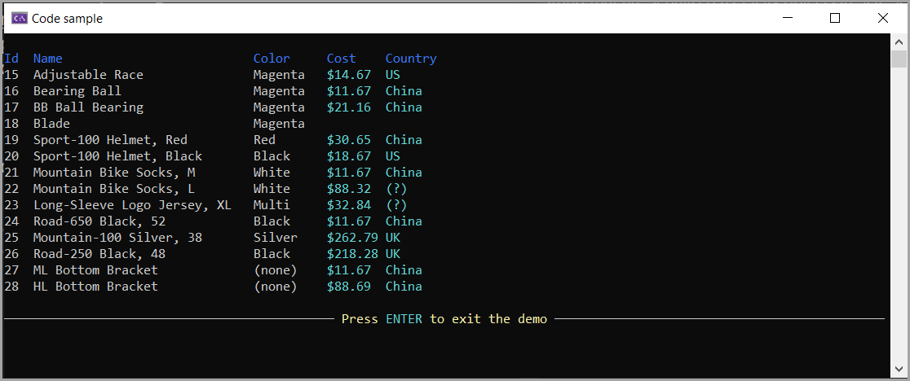
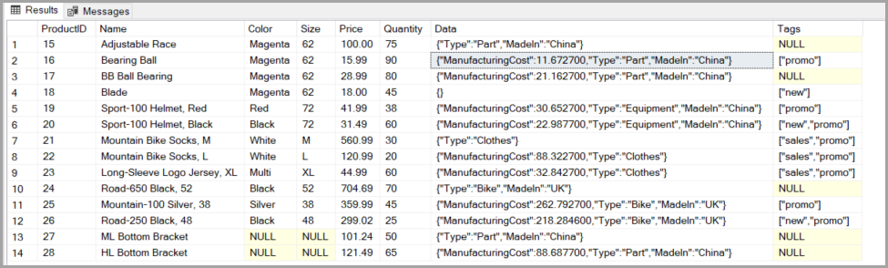

# About

Dapper, reading strings in a SQL-Server database table to Json.

Original project came from Microsoft [here](https://github.com/microsoft/sql-server-samples/blob/master/samples/features/json/Dapper-Orm/README.md).

The original code did not indicate that a NuGet package was needed [Dapper.JsonTypeMapping](https://www.nuget.org/packages/Dapper.JsonTypeMapping/0.8.2?_src=template) for adding Custom Type Mapping for objects and string that are serialized as JSON objects in SQL Server.

## Karen's modes

- Took the sample database table and modified content
- Created a Console project
- Create a simple GET
- Created required models

