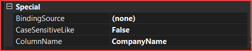
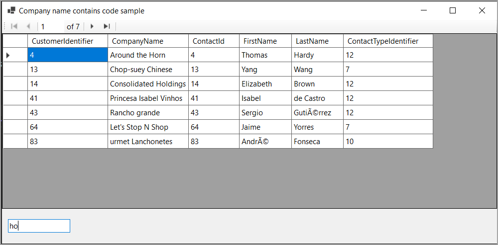

# About

An example to perform an incremental like filter with a custom TextBox.

> **Note**
> How this came about was from seeing a forum post and thought since I've done something similar before, lets expand and use a custom TextBox.

## TextBox custom

- A developer sets ColumName to the column to perform a LIKE condition on.
- CaseSensitiveLike control case sensitivity of a filter

## Original code

Found in the following GitHub [repository](https://github.com/karenpayneoregon/BindingSourceFiltering_C/tree/master) which does not have the custom TextBox.

## Database script

createAndPopulateNorthWind.sql found in the root of this solution.