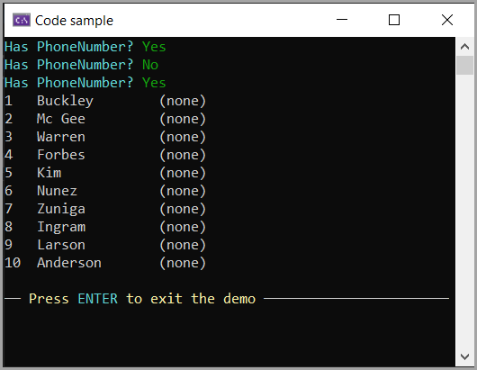

# About

This project demonstrates how to add a column to an existing SQL-Server database table along with setting values in existing rows of data.

:sparkles: *For SQL statements, they are all in a single class as read only text while for some they may prefer using stored procedures, feel free to place the statements into stored procedures.*

All data operations are performed with [Dapper NuGet package](https://www.nuget.org/packages/Dapper). For those who want to use stored procedures see [the following](https://github.com/DapperLib/Dapper?tab=readme-ov-file#stored-procedures) for use in Dapper.

## Setup

1. Create the database MockupApplication1 under localDb or change the server in the connection string in appsetting.json shown below.
1. Under the folder scripts, run populate.sql in SSMS or right from Visual Studio. Note there are two statements, run each separately, one to create the table, the other to populate the table.
1. Build/run the project


The database connection resides in appsettings.json

```json
{
  "ConnectionsConfiguration": {
    "ActiveEnvironment": "Development",
    "Development": "Data Source=(localdb)\\MSSQLLocalDB;Initial Catalog=MockupApplication1;Integrated Security=True;Encrypt=False",
    "Stage": "Stage connection string goes here",
    "Production": "Prod connection string goes here"
  }
}
```
---

When the project runs, if the PhoneNumber exists, it removed. Next the column is added with default values.

 
  


