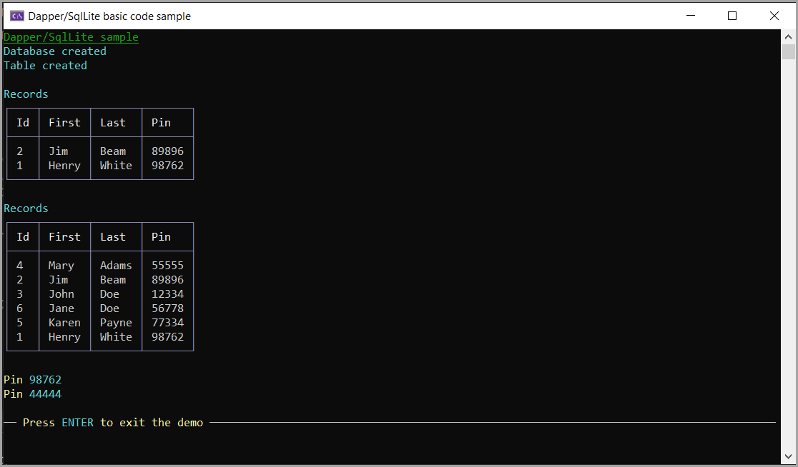

# About

An example of using an existing SqlLite database with one table, three existing records. 

Display the records, add several records and do a select/where.

> **Note**
> The database Copy to output directory = copy always so that each time the project runs old data is overwritten.

Dapper is used perform data operations. Dapper handles opening the connection, makes adding a range of records simple.

## Written with

- NET8
- Visual Studio 2022
- Dapper

