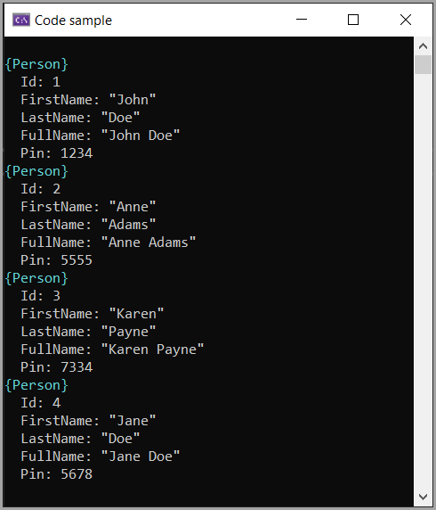

# About

An example for SqlLite in-memory database using Dapper.

## Important

Once the connection is closed the database no longer exists

## Steps

1. Create database in-memory
1. Create a table
1. Populate table
1. Edit record
1. View data

