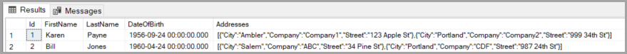
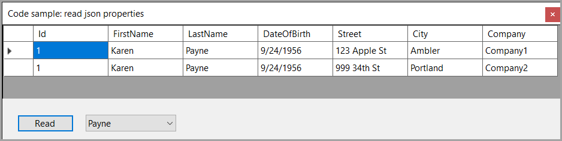

# About

An example of reading json data from a `NVARCHAR column` in a `SQL-Server` database table using `Dapper`.

The following query assumes that the `Person` table has a `JsonData` column that contains json data and there are two addresses, if there were more we need to adust the query parameter `@index < 2`.

Note in the data operations the key is to use `QueryMultiple` to read the data from the database followed using `while (!multi.IsConsumed)` to populate a list.

For a real application a separate class may be used that has base properties and a list of addresses.

## Prepare to run

Create a database named EF.Json under loaldb and create the table and populate from `Scripts\Script1.sql`.

## Raw data




## Model

```csharp
public class PersonAddress
{
    public int Id { get; set; }
    public string FirstName { get; set; }
    public string LastName { get; set; }
    public DateTime DateOfBirth { get; set; }
    public string Street { get; set; }
    public string City { get; set; }
    public string Company { get; set; }
    public override string ToString() => $"{FirstName} {LastName}";

}
```

## Data operations

```csharp
internal class DataOperations
{
    private IDbConnection _cn = new SqlConnection(DataConnections.Instance.MainConnection);

    /// <summary>
    /// Retrieves a list of person addresses based on the provided last name.
    /// </summary>
    /// <param name="lastName">The last name used to filter the person addresses.</param>
    /// <returns>
    /// A list of <see cref="PersonAddress"/> objects containing the person's
    /// details and their associated addresses.
    /// </returns>
    public List<PersonAddress> GetPerson(string lastName)
    {

        var list = new List<PersonAddress>();
        using var multi = _cn.QueryMultiple(SqlStatements.GetPersonAddresses, new {LastName = lastName});

        while (!multi.IsConsumed)
        {
            var partialResult = multi.Read<PersonAddress>();
            list.AddRange(partialResult);
        }

        return list;
    }

    public List<string> LastNames()
    {
        const string sql = "SELECT LastName FROM dbo.Person ORDER BY LastName;";
        return _cn.Query<string>(sql).ToList();
    }
}
```

## Windows Forms

Was used but any project type could be used, a windows forms project is simply easy to stand-up.

