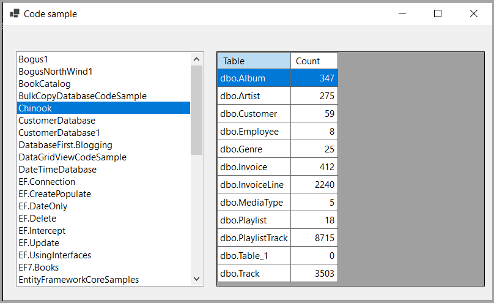

Shows how to get

- All databases names for a SQL-Server instance
- Get all table names and row counts in a database.

## Uses

The project SqlServerLibrary for 

- Models
- SQL statements

## Why Windows forms

Because its an easy way to test. Code presented will work in any project type.

## Data operations

Uses Dapper

